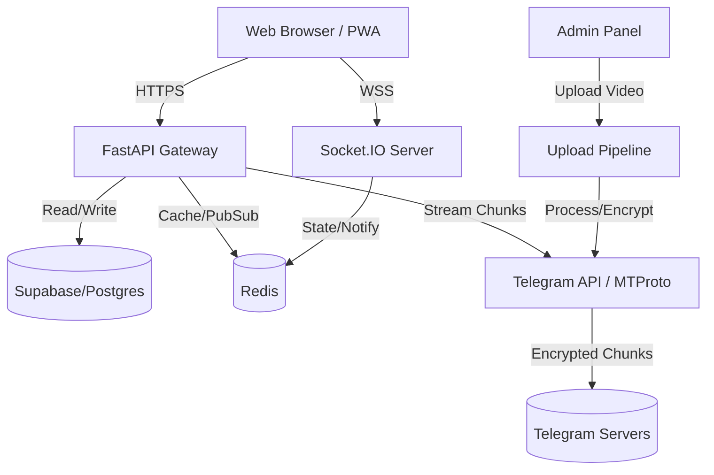

# NexusEdu Architecture

## 1. System Overview
NexusEdu is an enterprise-grade EdTech platform designed to serve large concurrent student populations with high-quality video content using a custom Telegram storage backend to radically reduce CDN costs.

## 2. Core Components

### Frontend (React + Vite + TypeScript)
- **UI Framework**: Tailwind CSS + shadcn/ui + Radix Primitives
- **State Management**: React Context + Zustand (for global UI states)
- **Video Player**: Custom adaptive bit-rate player integrating HLS and raw streaming depending on source.
- **Real-Time**: Socket.io-client for live classes, chat, and notifications.

### Backend (FastAPI + Python)
- **API Framework**: FastAPI for high-performance async request handling.
- **Real-Time**: python-socketio integration for bi-directional event processing.
- **Authentication**: Supabase Auth (JWT validation).
- **Background Workers**: Celery/Redis for Telegram upload pipelining and report generation.

### Data Layer
- **Relational Data**: Supabase (PostgreSQL) for Users, Catalog, Progress, and Access Control.
- **Caching**: Redis for query caching, rate limiting, and temporary file chunks.
- **Video Storage & Streaming**: Telegram MTProto (Pyrogram) configured as a distributed file store.

## 3. High-Level Data Flow

## 4. Scalability & Performance
To handle 1M+ active users, the architecture utilizes:
- **Stateless API tier**: Easily horizontally scaled via Render/Kubernetes.
- **Session Pooling**: Pyrogram MTProto sessions are pooled and distributed to prevent Telegram API rate limits.
- **Edge Caching**: Cloudflare CDN for static assets and public catalog pages.
- **Layered Caching Mechanism**: Local Memory -> Redis -> PostgreSQL.

## 5. Security Model
- **Zero Trust Storage**: Videos stored on Telegram are not raw MP4s; they are chunked, optionally encrypted, and only accessible via proxy through our authenticated API layers.
- **Row Level Security (RLS)**: Enforced via Supabase for direct database interactions.
- **Role-Based Access Control (RBAC)**: Handled elegantly in FastAPI dependency injection for students vs. admins.
