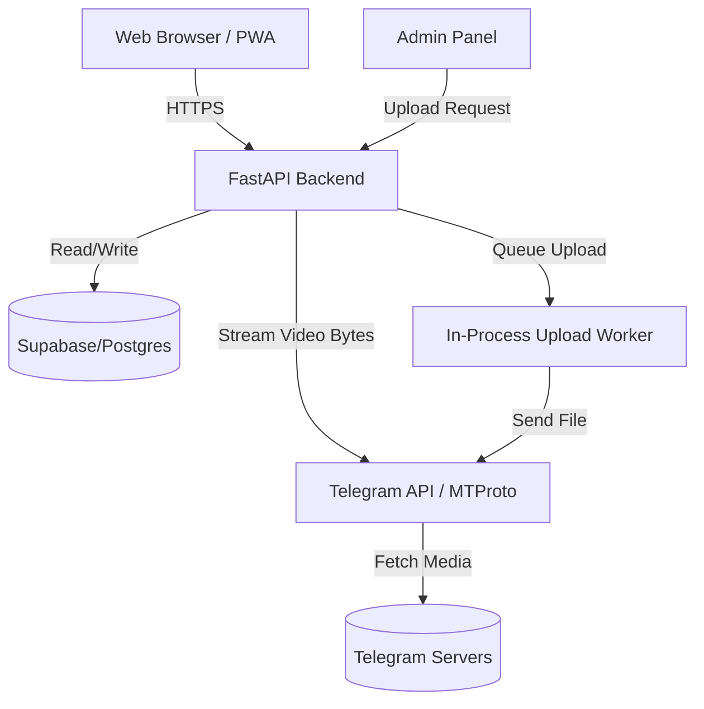

# NexusEdu Architecture

## 1. System Overview
NexusEdu is an EdTech platform designed for HSC students to access video content using Telegram as a video file storage backend.

## 2. Core Components

### Frontend (React + Vite + TypeScript)
- **UI Framework**: Tailwind CSS + shadcn/ui + Radix Primitives
- **State Management**: React Context + Zustand (for global UI states)
- **Video Player**: Custom video player supporting HLS, direct MP4 streaming, YouTube, and Google Drive links.

### Backend (FastAPI + Python)
- **API Framework**: FastAPI for request routing and proxying.
- **Authentication**: Supabase Auth (JWT validation).
- **Background Uploads**: In-process background loop in `backend/workers/upload_worker.py`.
- **Authorization**: Ad-hoc `_ensure_admin(request)` checks in route handlers.

### Data Layer
- **Relational Data & Auth**: Supabase (PostgreSQL) for Users, Catalog, Progress, and Access Control.
- **Video Storage & Streaming**: Telegram MTProto via Pyrogram storing media files in channel messages.

## 3. High-Level Data Flow

```mermaid
graph TD
    Client[Web Browser / PWA] -->|HTTPS| API[FastAPI Backend]
    
    API -->|Read/Write| Supabase[(Supabase/Postgres)]
    API -->|Stream Video Bytes| TG[Telegram API / MTProto]
    TG -->|Fetch Media| TelegramCloud[(Telegram Servers)]
    
    Admin[Admin Panel] -->|Upload Request| API
    API -->|Queue Upload| UploadWorker[In-Process Upload Worker]
    UploadWorker -->|Send File| TG
```

## 4. Security & Storage Model
- **Storage**: Videos are saved directly to Telegram channels via Pyrogram and streamed through backend proxy endpoints.
- **Row Level Security (RLS)**: Configured in Supabase for direct database queries.
- **Admin Endpoints**: Guarded by `_ensure_admin` session/token verification in route handlers.

## 5. NOT IMPLEMENTED
The following features are not implemented in this repository:
- **Background Workers: Celery/Redis**: No Celery setup exists; background tasks use `backend/workers/upload_worker.py`.
- **Real-Time: python-socketio / socket.io-client**: Socket.io server and client integration are absent.
- **Caching: Redis query caching & layered caching**: No multi-layer query cache or Redis video chunk caching exists.
- **1M+ Active Users scaling guarantees**: No specialized multi-node session pooling or distributed caching layer exists.
- **Edge Caching: Cloudflare CDN**: No Cloudflare CDN caching layer is configured.
- **Video Chunking & Encryption**: Videos are stored as plain Telegram file attachments without custom chunking or encryption.
- **RBAC in FastAPI Dependency Injection**: Admin access relies on explicit `_ensure_admin(request)` function calls inside route bodies rather than FastAPI `Depends()` RBAC pipelines.
