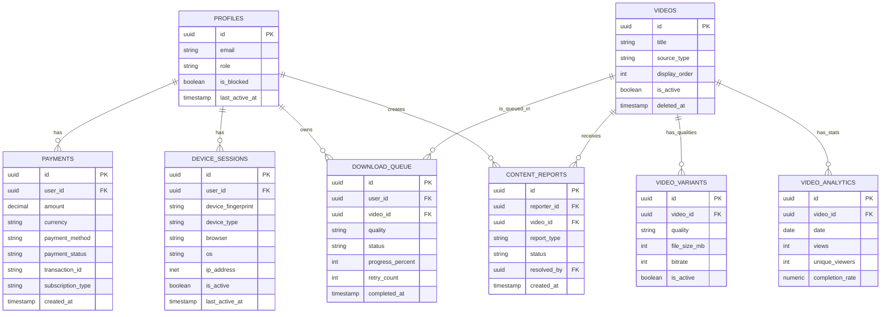

# Database Architecture

```mermaid
erDiagram
    PROFILES ||--o{ PAYMENTS : has
    PROFILES ||--o{ DEVICE_SESSIONS : has
    PROFILES ||--o{ DOWNLOAD_QUEUE : owns
    PROFILES ||--o{ CONTENT_REPORTS : creates
    
    VIDEOS ||--o{ VIDEO_VARIANTS : has_qualities
    VIDEOS ||--o{ DOWNLOAD_QUEUE : is_queued_in
    VIDEOS ||--o{ CONTENT_REPORTS : receives
    VIDEOS ||--o{ VIDEO_ANALYTICS : has_stats
    
    PROFILES {
        uuid id PK
        string email
        string role
        boolean is_blocked
        timestamp last_active_at
    }
    
    PAYMENTS {
        uuid id PK
        uuid user_id FK
        decimal amount
        string currency
        string payment_method
        string payment_status
        string transaction_id
        string subscription_type
        timestamp created_at
    }
    
    DEVICE_SESSIONS {
        uuid id PK
        uuid user_id FK
        string device_fingerprint
        string device_type
        string browser
        string os
        inet ip_address
        boolean is_active
        timestamp last_active_at
    }
    
    VIDEOS {
        uuid id PK
        string title
        string source_type
        int display_order
        boolean is_active
        timestamp deleted_at
    }
    
    VIDEO_VARIANTS {
        uuid id PK
        uuid video_id FK
        string quality
        int file_size_mb
        int bitrate
        boolean is_active
    }
    
    DOWNLOAD_QUEUE {
        uuid id PK
        uuid user_id FK
        uuid video_id FK
        string quality
        string status
        int progress_percent
        int retry_count
        timestamp completed_at
    }
    
    CONTENT_REPORTS {
        uuid id PK
        uuid reporter_id FK
        uuid video_id FK
        string report_type
        string status
        uuid resolved_by FK
        timestamp created_at
    }
    
    VIDEO_ANALYTICS {
        uuid id PK
        uuid video_id FK
        date date
        int views
        int unique_viewers
        numeric completion_rate
    }
```
